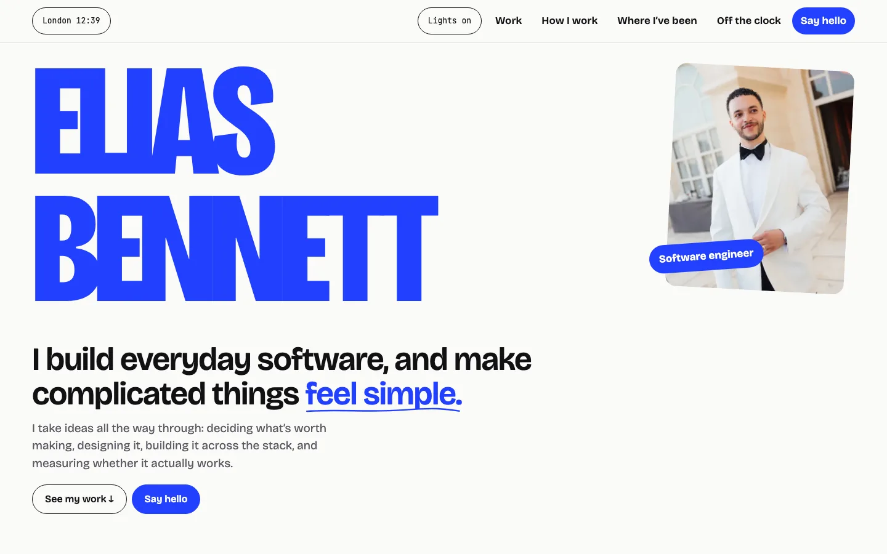
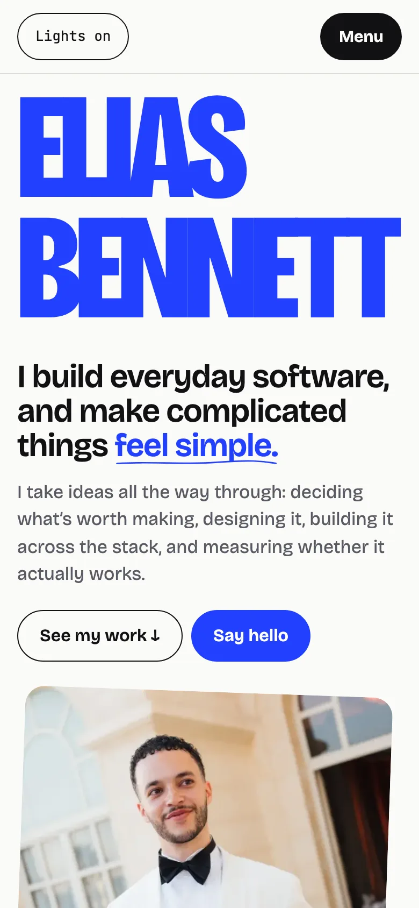

# eliasb.dev

The source of [eliasb.dev](https://www.eliasb.dev), Elias Bennett's personal site: what he builds, how he works, and what his time looks like away from the keyboard.



The visual direction is called **Stretch**: a clean neutral page, one cobalt accent used large, Bricolage Grotesque condensed at display size with JetBrains Mono for small print, and each project in the colours of its own interface. The terms used in the code and docs are defined in [`GLOSSARY.md`](GLOSSARY.md).



## What is on the site

| Route | What it is |
| --- | --- |
| `/` | The homepage: a signature entrance, then Work, How I work, Where I've been, Off the clock and Say hello. |
| `/work` | The archive: every project, newest first. Filters appear only once there are more than ten. |
| `/work/threshold`, `/work/argus-risk`, `/work/flowtime` | Case studies, each with a short visual story, a six-section write-up and a PRD card. |
| 404 | A custom not-found page. |

`/about`, `/lab` and `/library` redirect to the matching homepage anchors, so old links keep working.

**Off the clock** is the only section driven by outside data. It shows a training week (authored), what Elias is reading (Goodreads), what he last watched (Letterboxd), a weekly curiosity from Wikipedia's "On this day" feeds, what he is making now, and a year of GitHub contributions.

## Stack

- [Next.js](https://nextjs.org) 16 (App Router) and React 19, written in TypeScript
- Tailwind CSS 4 for the reset, with the design in plain CSS on custom properties (`src/app/stretch-tokens.css`)
- Bricolage Grotesque and JetBrains Mono through `next/font`
- The entrance and the light and dark setting run from small inline scripts, so the page is served finished and the entrance only plays over it
- [Playwright](https://playwright.dev) and axe for end-to-end, accessibility and contrast tests
- pnpm 10 and Node 22, deployed on Vercel

The decisions behind the rebuild are in [ADR 0005](docs/adr/0005-stretch-redesign.md) and the [spec](docs/specs/STRETCH-REDESIGN-SPEC.md). The design reference is [`docs/design/STRETCH.md`](docs/design/STRETCH.md).

## Run it

You need Node 22 and pnpm 10 (`corepack enable` will pick the pnpm version from `package.json`).

```bash
pnpm install
pnpm dev
```

Then open [http://localhost:3000](http://localhost:3000). The site works with no configuration; every live signal falls back to authored content.

To run the production build:

```bash
pnpm build
pnpm start
```

### Environment

Copy `.env.example` to `.env.local` if you want either of these.

| Variable | Default | What it does |
| --- | --- | --- |
| `GITHUB_SIGNAL_TOKEN` | unset | Optional, server-only, `read:user` scope. Lets the GitHub card show the contribution calendar shown on the profile. Without it the card uses public events, or an authored fallback. |
| `SITE_INDEXABLE` | `false` | Set `true` only for the production deployment. When false, the site is served with `noindex` and robots disallows crawling. |

Public source identifiers (GitHub, Letterboxd and Goodreads accounts) live in `src/content/integration-config.ts`.

## Live signals and their fallbacks

Each signal is fetched on the server, never in the browser, with a short timeout, a cache window and a shape check. A failure shows authored content instead of an empty card or an error.

| Signal | Source | Cache | If it fails |
| --- | --- | --- | --- |
| GitHub contributions | GitHub GraphQL with the token, else public events | 6 hours | Public-only trace, then an authored state |
| Reading | Goodreads RSS | 30 minutes | "Between books." |
| Last watched | Letterboxd RSS | 15 minutes | "Nothing logged yet." |
| Weekly Curiosity | Wikipedia "On this day" and Commons image metadata | 7 days | Saved examples, labelled as such |
| Now making | Authored entry, then the latest public GitHub repository | with the page | Latest repository, or nothing |

The homepage itself revalidates every 15 minutes. The contracts are in [`docs/integrations/SIGNALS.md`](docs/integrations/SIGNALS.md) and the troubleshooting steps in [`docs/runbooks/integration-fallbacks.md`](docs/runbooks/integration-fallbacks.md).

## Tests

End-to-end tests run against a production build, so build first. The suite covers the entrance, sections, Off the clock, theme, contrast, phone layouts, case studies, the archive, redirects and the 404, with axe on the main pages. It runs in Chromium and WebKit at 320, 390, 820 and 1440 px wide, in light and dark: 16 projects and roughly 3,600 tests, so run only what you need.

```bash
SITE_INDEXABLE=true pnpm build
pnpm exec playwright install chromium webkit
pnpm exec playwright test --project=chromium-1440-light e2e/work-archive.spec.ts
```

Playwright starts `pnpm start` itself on port 3100 (change it with `E2E_PORT`) and sets `BOARD_FIXTURES=1`, which turns on the `/fixtures` pages some specs use. Locally it runs one worker at a time.

Other checks, which CI also runs:

```bash
pnpm lint
pnpm exec tsc --noEmit
pnpm verify:signals      # signal adapters and their fallbacks
pnpm verify:catalogue    # the project catalogue
pnpm verify:copy         # every string matches docs/content/redesign-copy.md
pnpm verify:opening      # the entrance lifecycle
pnpm verify:routes       # canonical routes and redirects (needs a build)
pnpm verify:release      # production markup, metadata and links (needs a build)
```

CI (`.github/workflows/quality.yml`) builds with webpack (`SITE_INDEXABLE=true pnpm build --webpack`) and splits the Playwright matrix into eight shards.

## Project documents

- [`docs/specs/STRETCH-REDESIGN-SPEC.md`](docs/specs/STRETCH-REDESIGN-SPEC.md): scope, motion timings and tests
- [`docs/content/redesign-copy.md`](docs/content/redesign-copy.md): the approved copy
- [`docs/content/IMAGE-CREDITS.md`](docs/content/IMAGE-CREDITS.md): where each image comes from
- [`docs/adr/`](docs/adr): architecture decisions
- `docs/discovery`, `docs/review` and the earlier specs are history from the previous design and are kept for reference

## Licence and images

This repository has no licence file, so nothing here is offered for reuse. The photographs and project screenshots are Elias's own; credits are in [`docs/content/IMAGE-CREDITS.md`](docs/content/IMAGE-CREDITS.md).
