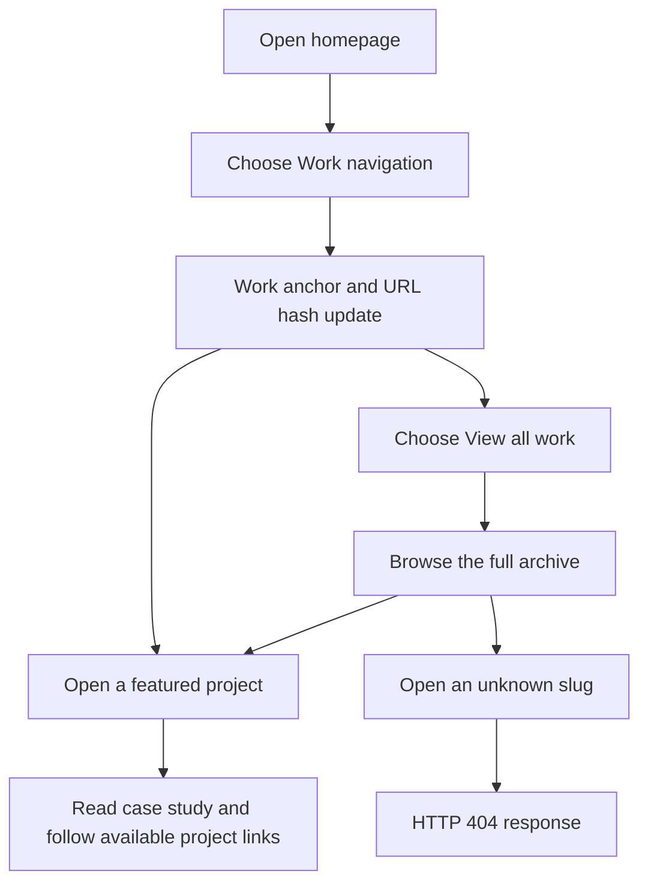
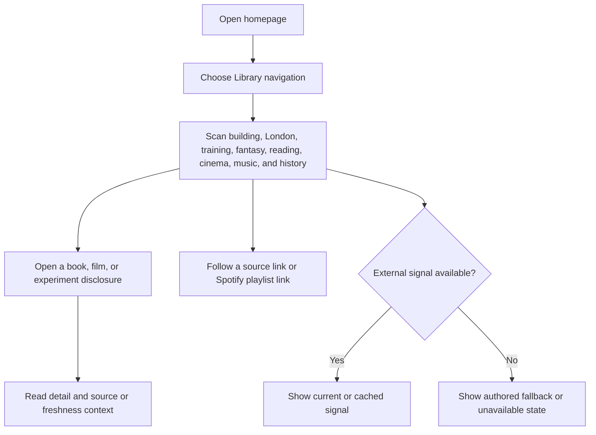
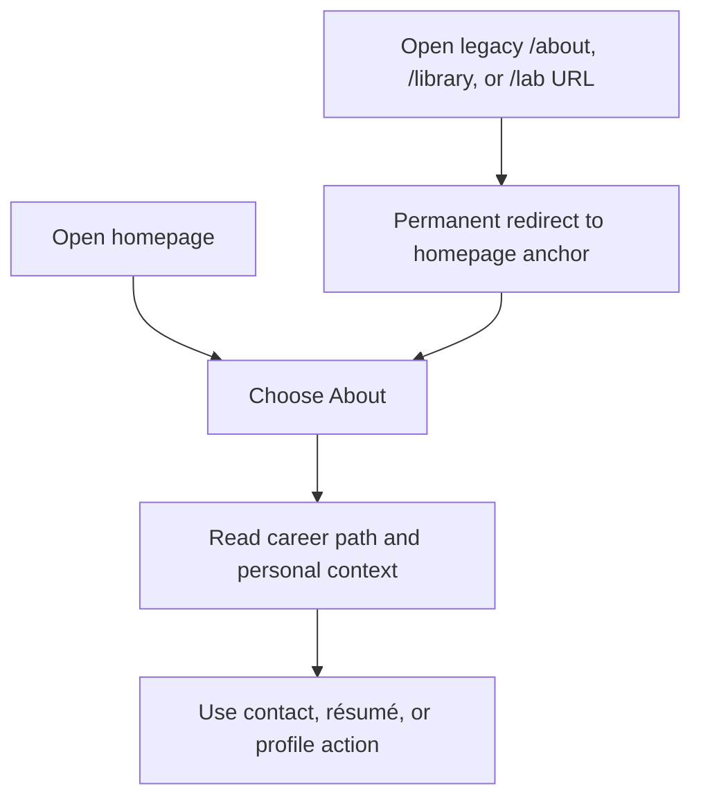

# Personal site dogfood and QA — codex/one-page-personal-surface

Review date: 2026-09-24. Candidate revision: f1c8af89d5b03c29c8c2c832ad5cecc8aa92dae7. Scope: the current branch’s production build, compared with origin/main at a902315 (merge base 6292698).

The candidate was built with SITE_INDEXABLE=true pnpm build --webpack and served locally with Next.js production server at 127.0.0.1:4173. Python Playwright 1.58.0 exercised installed Chromium, Firefox, and WebKit at 1440×960, 820×1024, and 390×844. This is Playwright WebKit engine coverage; it is not native Safari coverage.

## Outcome

The local candidate passed 556 browser assertions with zero failures. Lint, TypeScript, signal-contract, canonical-route, production-release, and build checks passed. The homepage, Work archive, case studies, compatibility routes, personal signals, About, and responsive layouts were exercised.

No site-owned functional defect was found, so no application code fix was needed. This pass added the report, five screenshots, and a cross-reference in the launch-validation record.

A read-only smoke check of https://www.eliasb.dev returned HTTP 200, but it serves an earlier version than this candidate: its navigation says “Outside work,” its hero copy differs, and it has no current featured-work card markup. The candidate is not live, so this local QA does not verify the deployed revision. No merge or deployment was part of this pass.

## Personas

- **Prospective product engineer or hiring colleague** (inferred from the design brief): wants to understand the work quickly, follow a case study, and find a direct contact path.
- **Fellow builder** (inferred): wants technical depth, project links, experiments, and truthful descriptions of system states.
- **Returning curious visitor** (inferred): wants to scan Library signals, understand their sources and freshness, and revisit a section from a shared link.

## User flows

### Find and follow the work

### Explore personal signals

### Learn about Elias and revisit legacy links

## Route coverage

| Route | Browser and viewport coverage | Result |
|---|---|---|
| / | Chromium, Firefox, and WebKit at all three viewports | Pass: one h1 and main landmark, no horizontal overflow, navigation and signal interactions checked. |
| /work | Chromium, Firefox, and WebKit at all three viewports | Pass: archive route renders with its primary heading and main landmark. |
| /work/threshold | Chromium, Firefox, and WebKit at all three viewports | Pass: route, heading, image alternatives, and layout. |
| /work/argus-risk | Chromium, Firefox, and WebKit at all three viewports | Pass: route, heading, image alternatives, and layout. |
| /work/flowtime | Chromium, Firefox, and WebKit at all three viewports | Pass: route, heading, image alternatives, and layout. |
| /about, /library, /lab | Chromium, Firefox, and WebKit at desktop; canonical route checker also exercised these redirects | Pass: each resolves to the matching homepage anchor. Firefox may report a cached 304 before the correct final destination. |
| /work/not-a-project | Chromium, Firefox, and WebKit at desktop | Pass: HTTP 404. |
| /concepts and its three concept routes | Chromium at desktop and mobile | Pass: routes rendered with one h1/main landmark and no horizontal overflow. |

The core pages and compatibility routes were checked at 1440×960 in all engines. The homepage, Work archive, and all three case studies were also checked at 820×1024 and 390×844 in all engines. The four concept routes were checked at 1440×960 and 390×844 in Chromium.

## Test matrix

| Journey | Scenario | Status | Evidence |
|---|---|---|---|
| Find and follow the work | Primary navigation, URL hashes, anchor graph, three featured cases, archive route, unknown work slug | Pass | All homepage hash targets resolved; Work, Library, and About updated the fragment. Three featured cards rendered at each viewport. |
| Read case studies | Threshold, Argus Risk, and Flowtime routes, imagery, alternatives, responsive layout | Pass | All six case-study images loaded in Chromium at mobile width; image alt attributes were present across the browser route matrix. |
| Explore Library | Current building, London, training, fantasy, reading, cinema, playlist, weekly history | Pass | Signal cards, accessible names, history sources, and Goodreads/Letterboxd links were present. Book, film, and experiment disclosures opened and closed. |
| Explore experiments | Ask Professor Past V1 and experiment disclosures | Pass | “This is V1 of Professor Past” is visible; native disclosure opens and closes. |
| Learn about Elias | Career path, portrait, professional copy, contact | Pass | White dinner-jacket portrait loaded with descriptive alt text. Mobile contact section exposes the Email me mailto link. |
| Use keyboard and native controls | Skip link, visible focus, primary links, theme control, and disclosures | Pass with WebKit limitation | Chromium and Firefox Tab reached the skip link; focus was visible and Enter moved to main. Directly focusing the WebKit skip link and pressing Enter also worked. |
| Read with motion reduced | Reduced-motion preference and hero content | Pass | Main content remained visible; the signature reached its complete state and its transitions were reduced to 0.00001s. |
| Change appearance | Light/dark theme and stored preference | Pass | Toggle changed theme, wrote the preference, and reversed successfully in all engines and viewports. |
| Readable responsive layout | Horizontal overflow, main landmark, primary heading, sampled text contrast | Pass | No overflow; one h1 and main landmark on all checked rendered pages. Sampled training labels measured at least 8.12:1; this is not a full-page contrast audit. |
| Verify release contracts | Build and production checks | Pass | The release verifier passed all 182 assertions; command observations are below. |

The mobile header hides its Say hello action at 390px by design. The Email me action in the Contact section was checked and remains available.

## Findings and follow-ups

1. **Production and candidate differ.** The public root returns HTTP 200 but displays the previous navigation and copy. Treat the candidate branch as locally verified and the deployed site as unverified for this revision. Recheck after the candidate is merged and deployed.
2. **Firefox reports a Spotify iframe error.** The Firefox Playwright run consistently reported Spotify’s cross-origin React error #418 from Spotify’s own embed scripts. The site host page had zero console or page errors, and the titled iframe plus direct “Open playlist in Spotify” link rendered. The provider frame is outside the site’s origin; retain the direct link as the fallback and recheck if the embed changes.
3. **WebKit anchor Tab order is inconclusive on this Mac.** With the current macOS keyboard-navigation setting, Tab skipped anchors in Playwright WebKit at desktop and mobile widths. Directly focusing the skip link showed visible focus and Enter moved to main. Rerun anchor Tab order with Full Keyboard Access enabled. Native Safari and a screen-reader session were not tested.

The initial mobile screenshot was taken at DOMContentLoaded before the client-side signature animation had settled. A second capture waited for the completed state; the hero then rendered normally within the mobile viewport. No site defect was recorded from the early capture.

## Visual evidence

These screenshots were captured from the local candidate after the hero settled:

- [Homepage — desktop](2026-09-24-evidence/home-1440.png)
- [Homepage — mobile](2026-09-24-evidence/home-390.png)
- [Featured work — mobile](2026-09-24-evidence/work-mobile.png)
- [Library — mobile](2026-09-24-evidence/library-mobile.png)
- [About and career path — mobile](2026-09-24-evidence/about-mobile.png)

## Command observations

| Check | Result |
|---|---|
| pnpm lint | Passed. |
| pnpm exec tsc --noEmit --incremental false | Passed. |
| pnpm verify:signals | Passed. |
| SITE_INDEXABLE=true pnpm build --webpack | Passed. |
| pnpm verify:routes | Passed. |
| SITE_INDEXABLE=true pnpm verify:release | Passed with 182 assertions. |
| git diff --check and report whitespace scan | Passed after documentation updates. |
| Playwright 1.58.0 browser matrix | 556 passed, 0 failed, 5 skipped. Three skips were the intentionally hidden mobile header action; two were WebKit anchor Tab order under the current macOS setting. |
| Host-page browser errors | None in Chromium, Firefox, or WebKit. Firefox Spotify iframe errors recorded separately above. |

## Final status

**Candidate branch: Pass.** **Current production deployment: not at the candidate revision.** The remaining browser limitations are Spotify’s Firefox embed failure, WebKit keyboard traversal under the current Mac setting, native Safari, and screen-reader testing.
